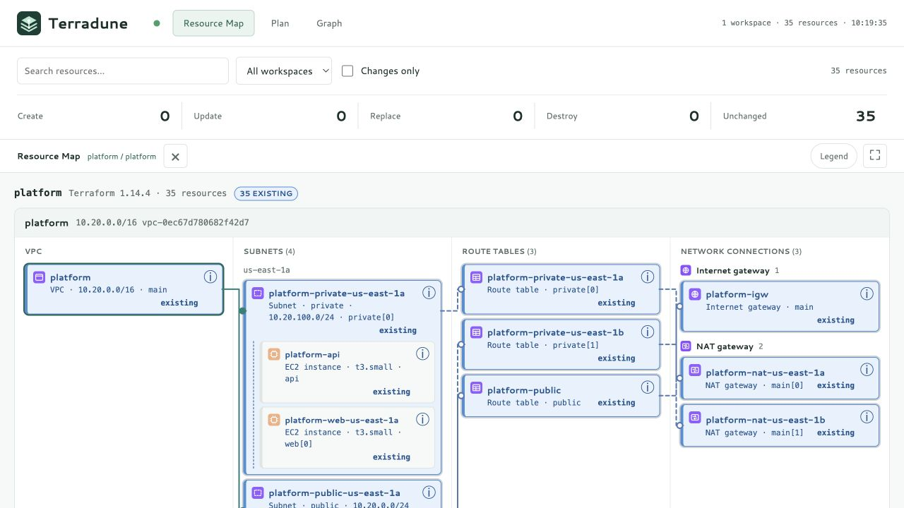

# Terradune

**Review Terraform plans as resources and relationships.**

Terradune turns initialized Terraform workspaces into a local plan review interface. See what will be created, changed, replaced, or destroyed; inspect configuration; and follow the dependencies behind each resource.

[](https://github.com/albatroxxx/terradune/actions/workflows/ci.yml)
[](https://pkg.go.dev/github.com/albatroxxx/terradune)
[](LICENSE)



**[Website](https://albatroxxx.github.io/terradune/) · [Installation guide](https://albatroxxx.github.io/terradune/docs/) · [Latest release](https://github.com/albatroxxx/terradune/releases/latest)**

## Start Reviewing

### Install Go

Terradune requires **Go 1.27.1 or newer** and a separate
[Terraform](https://developer.hashicorp.com/terraform/install) or
[OpenTofu](https://opentofu.org/docs/intro/install/) CLI.

1. Download Go for your operating system and architecture from [go.dev/dl](https://go.dev/dl/).
2. On macOS, run the package installer. On Windows, run the MSI installer.
   On Linux, follow the [official installation steps](https://go.dev/doc/install)
   to install into a fresh `/usr/local/go` directory and add
   `/usr/local/go/bin` to your PATH.
3. Reopen your terminal and run `go version`. Check that it is at least 1.27.1.

### Install Terradune

```sh
go install github.com/albatroxxx/terradune@latest
```

Go is the sole supported installation method. Use `@v1.0.5` instead of
`@latest` to pin this release.

Add Go's executable directory to your PATH. On macOS/Linux, for the current
terminal:

```sh
go_bin="$(go env GOBIN)"
export PATH="${go_bin:-$(go env GOPATH)/bin}:$PATH"
terradune -version
```

Add the same PATH setup to your shell profile, such as `~/.zshrc` or
`~/.bashrc`, to keep it for new terminals. On Windows PowerShell:

```powershell
$goBin = go env GOBIN
if (-not $goBin) { $goBin = Join-Path (go env GOPATH) "bin" }
$env:Path = "$goBin;$env:Path"
terradune -version
```

For future Windows terminals, add that directory to your user **Path** in
Environment Variables. Go uses `GOBIN` when set, otherwise `GOPATH/bin`;
see [Go's installation behavior](https://go.dev/doc/code#Command).

### Review A Workspace

```sh
terraform -chdir=./infra init
terradune ./infra
```

Replace `./infra` with your Terraform working directory. On an OpenTofu-only
machine, initialize with `tofu -chdir=./infra init`. Terradune uses
`terraform` when installed and falls back to `tofu`; the workspace header
names the CLI that produced the plan.

Open the printed local URL, normally `http://localhost:8383`. Provider
credentials and inputs work as they do with your CLI, including AWS profiles,
SSO, and environment variables.

```sh
# Scan initialized workspaces beneath a directory.
terradune ./environments

# Supply plan inputs.
terradune -var-file prod.tfvars -var region=eu-west-2 ./infra

# Use a different local port.
terradune -port 8484 ./infra
```

Terradune never runs `terraform apply`. It runs `plan`, `show`, and
`graph`; planning can contact providers and data sources. Refresh is off by
default. The server binds to loopback. There is no authentication or TLS;
keep it local.

## Update Or Remove

Stop Terradune with Ctrl+C before updating, then run:

```sh
go install github.com/albatroxxx/terradune@latest
terradune -version
```

To remove it, delete `terradune` (or `terradune.exe` on Windows) from
`go env GOBIN`, or from `GOPATH/bin` if GOBIN is empty. Leave your
Terraform working directories and state files intact. Terradune keeps no
persistent state of its own; temporary plan directories are cleaned up.

## Three Views, One Plan

### Resource Map

The default view groups VPCs, subnets, route tables, gateways, and load balancers by their infrastructure roles. Resources can appear in more than one contextual placement here; those placements do not duplicate the Plan inventory.

Subnets show up to three compact, naturally sorted resource references. **View all** opens the subnet-filtered VPC inventory. **Resources in this VPC** uses compact cards grouped into compute and containers, databases and caches, storage, networking, security, and other resources. Shared resources appear once in that inventory. Placement follows plan relationships, including supported subnet groups, rather than assuming every AWS resource belongs to a VPC.

Single-click a resource to keep its path highlighted without hiding other resources. Double-click, or choose **Focus path**, to narrow the map while retaining its VPC and subnet sections. Use the details button to inspect a resource. Solid teal lines end in filled circles for direct dependencies; dashed blue lines end in hollow circles for indirect associations through collapsed routes or attachments. Connections route around cards and are masked behind card interiors. Pins and paths stay within their workspace.

Changes to separate routes, associations, and attachments appear on their parent as attached changes, without changing the parent's Terraform action. The connection list opens their individual details, including deleted routes and unresolved endpoints. With **Changes only** enabled, the map keeps relevant unchanged endpoints and containers for context; the counter distinguishes them from actual changes.

Compact navigation and action counts leave more room for the active view. Filters can collapse manually or while scrolling down, and return when scrolling up. The **Expand view** control hides navigation and filters while keeping view controls available. **Restore view** brings them back without clearing filters or the pin. Escape closes details, then the legend, then a pinned path, then restores an expanded view.

### Plan

The resource register lists each managed resource once per workspace, including route associations and unfamiliar resource types. Destructive changes sort first. Filter by action, exact resource type, workspace, or search; enable **Changes only** to hide unchanged resources. The resource-type list and counts reflect those filters. A selected type with no remaining matches resets to **All resource types**.

Open a resource to inspect **What changes**, followed by configuration, attached resources, and dependencies. Changed attributes have explicit **Before** and **After** columns for creation, update, replacement, and deletion; changed attached resources use the same comparison. Unknown values remain marked as known after apply. Sensitive values stay masked, including nested objects and lists. Redacted values can prevent a visible comparison; the UI does not invent a difference when values are unavailable.

### Graph

Open the relationship action on a resource for its direct dependency neighborhood, or use the full graph. Resource identity includes the workspace, so identical addresses in separate environments remain distinct. Arrowheads point **from the dependent to its prerequisite**; ELK supplies the routed paths.

Zoom and fit controls are available above the graph. Graph nodes can be focused and opened with Enter or Space. With the graph focused, arrow keys pan, `+`/`-` zoom, and `0` fits the graph.

## Coverage

| Area | Current behavior |
| --- | --- |
| Managed resource types | Generic Plan rows and configuration for every type emitted in resource changes; no AWS allowlist |
| AWS services | Dedicated filters for each exact resource type; recognized types have friendly labels and icons, with generic fallbacks for unfamiliar types |
| Resource instances | Full `count`, `for_each`, and module addresses retained |
| Actions | Create, update, replace, destroy, unchanged |
| Relationships | Configuration references, Terraform DOT dependencies, and matching resolved IDs/ARNs |
| Workspaces | Scan initialized directories, filter scope, and receive live plan updates |
| CLI | Terraform, or OpenTofu where Terraform is absent; the plan names which one ran |
| Network layout | Specialized AWS VPC and load-balancer views |

**Generic type coverage is not complete Terraform feature parity.** Data sources are currently followed as reference paths rather than shown as inventory entries. Imports, moves, output changes, deferred plans, and alias-aware account/region metadata need explicit lifecycle support. The [makeover plan](docs/MAKEOVER.md) defines that compatibility work and its acceptance criteria.

Terradune does not invent an instance-level relationship when a plan cannot identify it. Ambiguous dependencies through locals or multiple instances may remain absent before apply. Resources managed outside the scanned plans are not discovered from the AWS account.

## Flags

| Flag | Default | Purpose |
| --- | --- | --- |
| `-port` | `8383` | Local HTTP port |
| `-host` | `127.0.0.1` or `TERRADUNE_HOST` | Listen IP or localhost |
| `-var-file` | none | Terraform variable file; repeatable |
| `-var` | none | Terraform `name=value` input; repeatable |
| `-refresh` | `false` | Refresh state before planning |
| `-print` | `false` | Print inventory and dependencies once, without serving |
| `-version` | false | Print the version and exit |

## Architecture

```text
Terraform plan / show / graph
             |
           ingest           workspace discovery and plan execution
             |
           graph            resource identity, dependencies, metadata, details
             |
           server           localhost JSON endpoints and SSE snapshots
             |
    Resource Map / Plan / Graph
```

`internal/watch` observes Terraform source edits. The browser, fonts, logo, service glyphs, and ELK engine are embedded in the Go binary; the UI needs no CDN or JavaScript build step. The new review surface is separated into `assets/review.js` and `assets/review.css`.

Service glyphs are project-authored category icons, not official AWS architecture icons. The Terradune mark combines stacked terrain with connected nodes and is shared by the app, favicon, and this README.

## Development

```sh
git clone https://github.com/albatroxxx/terradune.git
cd terradune
terraform -chdir=examples/platform init
go run . examples/platform
```

| Example | Scenario |
| --- | --- |
| `examples/simple` | Non-AWS resources |
| `examples/vpc` | New VPC resources with unknown IDs |
| `examples/ec2` | Instances, volumes, and load balancing |
| `examples/platform` | 35 resources across two AZs with an ALB |
| `examples/layered` | Network and application modules wired through locals |
| `examples/estate` | A broad, multi-VPC AWS estate |

The last three include **synthetic** applied state generated by `examples/tools/fakeapply.py`; they are not snapshots of a real AWS account. Some providers still contact AWS during planning, even with refresh disabled.

## Testing And Security

```sh
go test ./...
go test -race ./...
go vet ./...
```

Frontend behavior checks execute the real scripts against plan fixtures using JavaScriptCore or Node.js. CI installs Node and fails if no JS runtime is available, so frontend checks are not silently skipped on Linux. Browser verification and before/after screenshots are recorded in the [review report](docs/review/README.md).

CI also runs `gosec`, `staticcheck`, `govulncheck`, and Semgrep. Passing local unit tests is not a substitute for those scans. See [the workflow](.github/workflows/ci.yml).

Plan files may contain sensitive data. Inventory metadata and details apply Terraform's sensitivity masks, including nested values. Unmarked secrets and provider diagnostics cannot be identified automatically. Keep Terradune on localhost and use synthetic plans when publishing screenshots. See [SECURITY.md](SECURITY.md).

CI verifies Go installation on Linux, macOS, and Windows, plus real Terraform and OpenTofu planning. A per-workspace scheduler serializes plans and coalesces edits; slow SSE consumers receive the latest snapshot. Release checks and publication gates are documented in the [release runbook](docs/RELEASING.md).

## Reporting A Bug

Open a [bug report](https://github.com/albatroxxx/terradune/issues/new?template=bug_report.yml).
The form asks for what makes one actionable: the version, how it was installed,
whether it is driving Terraform or OpenTofu, which view, and steps someone else
can follow.

**A vulnerability is not a bug report.** Report it
[privately](https://github.com/albatroxxx/terradune/security/advisories/new)
instead; see [SECURITY.md](SECURITY.md).

Reproduce against a bundled example wherever you can. `examples/platform`,
`examples/estate`, and `examples/layered` all run offline, so naming one and the
steps you took means anyone can see exactly what you saw. If it only happens on
your own infrastructure, shrink it to the smallest configuration that still
shows the problem; `examples/tools/fakeapply.py` builds a synthetic applied
state, so a reproduction never needs a real account.

Terradune masks values Terraform marks sensitive. It does not mask unmarked
secrets, resource addresses, IP ranges, account identifiers, file paths, or
provider diagnostics. Read whatever you attach — `terradune -print` output,
terminal logs, screenshots — before posting it.

## Contributing

Start with the [makeover plan](docs/MAKEOVER.md) and [prioritized review findings](docs/review/README.md). Add fixtures for new Terraform lifecycle behavior and preserve generic rendering for unfamiliar resource types. Changes should pass tests, formatting, and CI scans.

## License

Terradune is Apache License 2.0. See [LICENSE](LICENSE). Bundled fonts and the layout engine have [their own notices](internal/server/assets/THIRD-PARTY.md).
