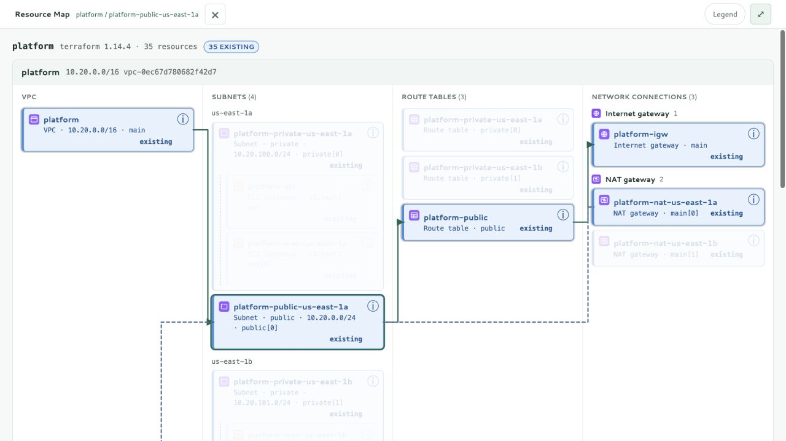

# Terradune

**Review Terraform plans as resources and relationships.**

Terradune turns initialized Terraform workspaces into a local plan review interface. See what will be created, changed, replaced, or destroyed; inspect configuration; and follow the dependencies behind each resource.

[](https://github.com/albatroxxx/terradune/actions/workflows/ci.yml)
[](https://pkg.go.dev/github.com/albatroxxx/terradune)
[](LICENSE)



**[Website](https://albatroxxx.github.io/terradune/) · [Installation guide](https://albatroxxx.github.io/terradune/docs/) · [Latest release](https://github.com/albatroxxx/terradune/releases/latest)**

## Start Reviewing

### Docker

The image includes Terraform and supports Linux AMD64 and ARM64. From your Terraform working directory, in a POSIX shell:

```sh
# :latest follows the newest release; pin a version such as :1.0.1 when you
# need the same image back, or the digest from the release notes for immutability.
IMAGE=ghcr.io/albatroxxx/terradune:latest
docker run --rm --user "$(id -u):$(id -g)" \
  -v "$PWD:/workspace" --entrypoint terraform "$IMAGE" init -input=false
docker run --rm --user "$(id -u):$(id -g)" \
  --cap-drop ALL --security-opt no-new-privileges \
  --read-only --tmpfs /tmp:mode=1777 \
  -p 127.0.0.1:8383:8383 -v "$PWD:/workspace" "$IMAGE"
```

Initialize inside the container even if the host is already initialized. Linux providers live in `.terradune/`, separate from native `.terraform/`; add `.terradune/` to your workspace's `.gitignore`. The mount must be writable. Forward credentials to both commands when your backend or provider requires them. See the [Docker guide](docs/DOCKER.md) for AWS profiles, Compose, Windows, and troubleshooting.

### Binary

Signed archives for Linux, macOS, and Windows on AMD64 and ARM64 are attached
to every release from v1.0.1 onward, alongside `checksums.txt` and
`checksums.txt.sigstore.json`. The commands below always fetch the newest
release; verify before extracting:

```sh
# Requires curl, jq, and cosign 3; run in an empty directory.
set -e
VERSION=$(curl -fsSL https://api.github.com/repos/albatroxxx/terradune/releases/latest |
  jq -er '.tag_name | ltrimstr("v")')
OS=darwin; ARCH=arm64
BASE=https://github.com/albatroxxx/terradune/releases/download/v$VERSION
curl -fsSLO "$BASE/terradune_${VERSION}_${OS}_${ARCH}.tar.gz"
curl -fsSLO "$BASE/checksums.txt"
curl -fsSLO "$BASE/checksums.txt.sigstore.json"
cosign verify-blob checksums.txt --bundle checksums.txt.sigstore.json \
  --certificate-identity-regexp '^https://github\.com/albatroxxx/terradune/\.github/workflows/release\.yml@refs/(heads/main|tags/v[0-9]+\.[0-9]+\.[0-9]+)$' \
  --certificate-oidc-issuer https://token.actions.githubusercontent.com
shasum -a 256 --ignore-missing -c checksums.txt
tar xzf "terradune_${VERSION}_${OS}_${ARCH}.tar.gz" terradune
```

The Sigstore bundle contains the signature and verification evidence. Verification
requires this repository's release workflow identity, not an arbitrary workflow
or pull request. Windows archives use `.zip` instead of `.tar.gz`.

### Go

Requires Go 1.27.1+, a Terraform or OpenTofu CLI on your `PATH`, and an
initialized workspace.

```sh
# @latest resolves the newest release; a tag such as @v1.0.1 pins one.
go install github.com/albatroxxx/terradune@latest
terraform -chdir=./infra init
terradune ./infra
```

Open the printed local URL, normally `http://localhost:8383`. Run `terraform init` in the workspace first. Provider credentials and inputs work the same way they do with Terraform, including AWS profiles, SSO, and environment variables.

Since v1.0.1, Terradune drives `terraform` when installed and falls back to
`tofu`, so an OpenTofu-only machine needs no extra configuration. The workspace
header names whichever produced the plan. The container image ships Terraform;
v1.0.0 requires Terraform.

```sh
# Scan initialized workspaces beneath a directory.
terradune ./environments

# Supply plan inputs.
terradune -var-file prod.tfvars -var region=eu-west-2 ./infra

# Use a different local port.
terradune -port 8484 ./infra
```

Terradune never runs `terraform apply`. It runs `plan`, `show`, and `graph`; planning can contact providers and data sources. Refresh is off by default. Native execution binds to loopback. Docker listens inside the container and the commands above publish only to host loopback. There is no authentication or TLS; do not publish this port to the internet.

## Update Or Remove

Terradune keeps no configuration, cache, or state of its own. It creates one
temporary directory per plan and deletes it again, so updating is replacing a
binary or an image, and removing is deleting one. Nothing migrates between
versions.

Compare what you are running against what is current:

```sh
terradune -version
gh release view --repo albatroxxx/terradune --json tagName --jq .tagName
```

### Docker

```sh
# Update: latest follows the newest release; name a version to pin one.
docker pull ghcr.io/albatroxxx/terradune:latest

# Remove: list what you have, then drop what you no longer need.
docker images ghcr.io/albatroxxx/terradune --format '{{.Repository}}:{{.Tag}}'
docker rmi ghcr.io/albatroxxx/terradune:1.0.0
```

`1` and `1.0` follow the newest matching release and `latest` follows the newest
of all, so pin the digest from the release notes whenever you need to get exactly
the same image back later. With Compose, edit the `image:` line, then
`docker compose pull && docker compose up`; `docker compose down` removes the
container.

The container initializes providers into `.terradune/` in each workspace, and
that outlives the image. Delete it per workspace when you are done:

```sh
rm -rf .terradune
```

Leave `.terraform/` alone — that one belongs to your own Terraform CLI, not to
Terradune. See the [Docker guide](docs/DOCKER.md#provider-data).

### Binary

Update by unpacking a newer archive over the old binary, verifying it the same
way as the first install. Remove it by deleting it:

```sh
rm "$(command -v terradune)"
```

### Go

```sh
# Update: installs over the previous build. A tag such as @v1.0.1 pins one.
go install github.com/albatroxxx/terradune@latest

# Remove.
rm "$(go env GOPATH)/bin/terradune"
```

`go clean -modcache` also clears the download cache, but it clears it for every
module on the machine, which is rarely what you want for one tool.

## Three Views, One Plan

### Resource Map

The default view groups VPCs, subnets, route tables, gateways, and load balancers by their infrastructure roles. Resources can appear in more than one contextual placement here; those placements do not duplicate the Plan inventory.

Pin a resource to keep its path highlighted, or use its details button. Solid green arrows follow the network path; dashed blue lines indicate direct associations. Connections route around card headers and remain visible when columns stack. Pins and paths stay within their workspace. The legend groups resource actions and connection styles.

The **Expand view** control hides the header and filters to give the active map, plan, or graph more room. **Restore view** brings them back without clearing the current filters or pin. Escape closes details, then the legend, then a pinned path, then restores an expanded view.

### Plan

The resource register lists each managed resource once per workspace, including route associations and unfamiliar resource types. Destructive changes sort first. Filter by action, service, workspace, or search; enable **Changes only** to hide unchanged resources.

Open a resource to inspect its configuration, attached resources, and dependencies. Updated and replaced resources show before/after values. Terraform's unknown values remain marked as known after apply. Sensitive detail values are masked using Terraform's sensitivity metadata, including nested objects and lists.

### Graph

Open the relationship action on a resource for its direct dependency neighborhood, or use the full graph. Resource identity includes the workspace, so identical addresses in separate environments remain distinct. Arrowheads point **from the dependent to its prerequisite**; ELK supplies the routed paths.

Zoom and fit controls are available above the graph. Graph nodes can be focused and opened with Enter or Space. With the graph focused, arrow keys pan, `+`/`-` zoom, and `0` fits the graph.

## Coverage

| Area | Current behavior |
| --- | --- |
| Managed resource types | Generic Plan rows and configuration for every type emitted in resource changes; no AWS allowlist |
| AWS services | Service groups and icons where recognized; unknown AWS and AWS Cloud Control types retain a generic fallback |
| Resource instances | Full `count`, `for_each`, and module addresses retained |
| Actions | Create, update, replace, destroy, unchanged |
| Relationships | Configuration references, Terraform DOT dependencies, and matching resolved IDs/ARNs |
| Workspaces | Scan initialized directories, filter scope, and receive live plan updates |
| CLI | Terraform, or OpenTofu where Terraform is absent; the plan names which one ran |
| Network layout | Specialized AWS VPC and load-balancer views |

**Generic type coverage is not complete Terraform feature parity.** Data sources are currently followed as reference paths rather than shown as inventory entries. Imports, moves, output changes, deferred plans, and alias-aware account/region metadata need explicit lifecycle support. The [makeover plan](docs/MAKEOVER.md) defines that compatibility work and its acceptance criteria.

Terradune does not invent an instance-level relationship when a plan cannot identify it. Ambiguous dependencies through locals or multiple instances may remain absent before apply. Resources managed outside the scanned plans are not discovered from the AWS account.

## Flags

| Flag | Default | Purpose |
| --- | --- | --- |
| `-port` | `8383` | Local HTTP port |
| `-host` | `127.0.0.1` or `TERRADUNE_HOST` | Listen IP or localhost; Docker sets `0.0.0.0` internally |
| `-var-file` | none | Terraform variable file; repeatable |
| `-var` | none | Terraform `name=value` input; repeatable |
| `-refresh` | `false` | Refresh state before planning |
| `-print` | `false` | Print inventory and dependencies once, without serving |
| `-version` | false | Print the version and exit |

## Architecture

```text
Terraform plan / show / graph
             |
           ingest           workspace discovery and plan execution
             |
           graph            resource identity, dependencies, metadata, details
             |
           server           localhost JSON endpoints and SSE snapshots
             |
    Resource Map / Plan / Graph
```

`internal/watch` observes Terraform source edits. The browser, fonts, logo, service glyphs, and ELK engine are embedded in the Go binary; the UI needs no CDN or JavaScript build step. The new review surface is separated into `assets/review.js` and `assets/review.css`.

Service glyphs are project-authored category icons, not official AWS architecture icons. The Terradune mark combines stacked terrain with connected nodes and is shared by the app, favicon, and this README.

## Development

```sh
git clone https://github.com/albatroxxx/terradune.git
cd terradune
terraform -chdir=examples/platform init
go run . examples/platform
```

| Example | Scenario |
| --- | --- |
| `examples/simple` | Non-AWS resources |
| `examples/vpc` | New VPC resources with unknown IDs |
| `examples/ec2` | Instances, volumes, and load balancing |
| `examples/platform` | 35 resources across two AZs with an ALB |
| `examples/layered` | Network and application modules wired through locals |
| `examples/estate` | A broad, multi-VPC AWS estate |

The last three include **synthetic** applied state generated by `examples/tools/fakeapply.py`; they are not snapshots of a real AWS account. Some providers still contact AWS during planning, even with refresh disabled.

## Testing And Security

```sh
go test ./...
go test -race ./...
go vet ./...
```

Frontend behavior checks execute the real scripts against plan fixtures using JavaScriptCore or Node.js. CI installs Node and fails if no JS runtime is available, so frontend checks are not silently skipped on Linux. Browser verification and before/after screenshots are recorded in the [review report](docs/review/README.md).

CI also runs `gosec`, `staticcheck`, `govulncheck`, and Semgrep. Passing local unit tests is not a substitute for those scans. See [the workflow](.github/workflows/ci.yml).

Plan files may contain sensitive data. Inventory metadata and details apply Terraform's sensitivity masks, including nested values. Unmarked secrets and provider diagnostics cannot be identified automatically. Keep Terradune on localhost and use synthetic plans when publishing screenshots. See [SECURITY.md](SECURITY.md).

CI also builds and runs both container architectures through initialization, planning, API checks, and graceful shutdown, then scans the shipped image. A per-workspace scheduler serializes plans and coalesces edits; slow SSE consumers receive the latest snapshot. Release checks and publication gates are documented in the [release runbook](docs/RELEASING.md).

## Reporting A Bug

Open a [bug report](https://github.com/albatroxxx/terradune/issues/new?template=bug_report.yml).
The form asks for what makes one actionable: the version, how it was installed,
whether it is driving Terraform or OpenTofu, which view, and steps someone else
can follow.

**A vulnerability is not a bug report.** Report it
[privately](https://github.com/albatroxxx/terradune/security/advisories/new)
instead; see [SECURITY.md](SECURITY.md).

Reproduce against a bundled example wherever you can. `examples/platform`,
`examples/estate`, and `examples/layered` all run offline, so naming one and the
steps you took means anyone can see exactly what you saw. If it only happens on
your own infrastructure, shrink it to the smallest configuration that still
shows the problem; `examples/tools/fakeapply.py` builds a synthetic applied
state, so a reproduction never needs a real account.

Terradune masks values Terraform marks sensitive. It does not mask unmarked
secrets, resource addresses, IP ranges, account identifiers, file paths, or
provider diagnostics. Read whatever you attach — `terradune -print` output,
terminal logs, screenshots — before posting it.

## Contributing

Start with the [makeover plan](docs/MAKEOVER.md) and [prioritized review findings](docs/review/README.md). Add fixtures for new Terraform lifecycle behavior and preserve generic rendering for unfamiliar resource types. Changes should pass tests, formatting, and CI scans.

## License

Terradune is Apache License 2.0. See [LICENSE](LICENSE). Bundled fonts and the layout engine have [their own notices](internal/server/assets/THIRD-PARTY.md). The container also includes Terraform under its upstream BUSL-1.1 license and third-party dependencies under their respective licenses. See [Docker packaging](docs/DOCKER.md#image-provenance).
