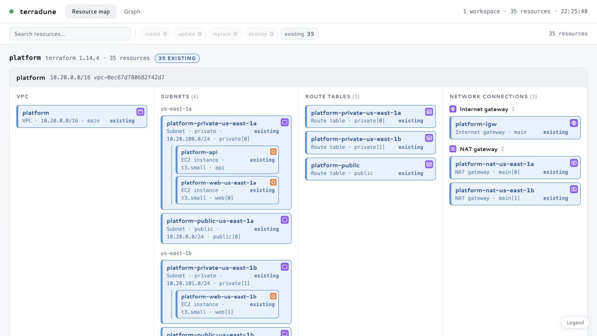
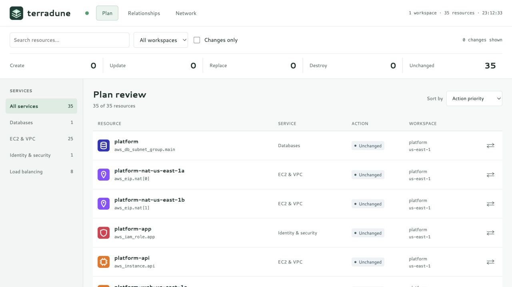
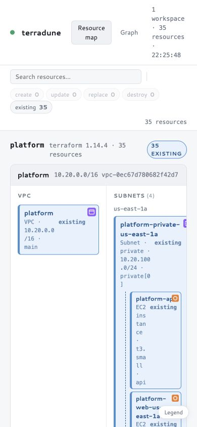
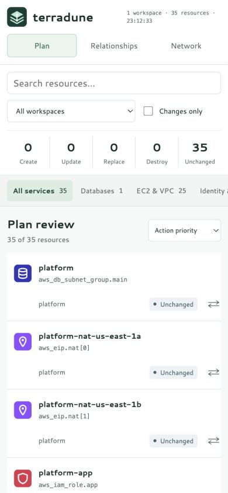
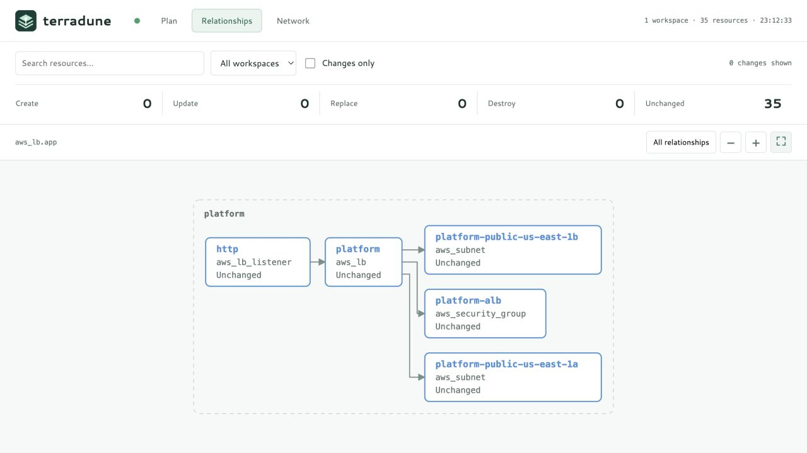

# Terradune Makeover Review

Baseline: `fc556ab6fd03e66cad99b06677785277bc45603f`. The [complete makeover plan](../MAKEOVER.md) defines the product direction, architecture, coverage matrix, milestones, and acceptance criteria. This PR delivers the review foundation and identity milestone.

## Implemented

- A new default Plan register includes every managed resource once per workspace, including unfamiliar AWS types and map-specific glue resources.
- Action priority sorting, service navigation, workspace selection, search, and changes-only filtering compose into a plan-review workflow.
- Relationships has a direct-neighbor view, workspace-qualified node keys, ELK-routed paths, zoom/fit controls, keyboard navigation, and generation guards against stale layouts.
- Native resource actions and a modal detail inspector support keyboard activation, focus restoration, safe error rendering, and stale-response protection.
- Details use the Terraform library's sanitization helper to mask sensitive before/after values, including nested maps/lists. Related resources consume the same sanitized details.
- Responsive Plan rows replace the cramped mobile map as the default experience. Network remains a secondary specialized view with responsive columns and corrected ribbon sizing after resize.
- The Terradune SVG mark is used in the header, favicon, and rewritten README. Go module imports, installation instructions, badges, and repository links use `albatroxxx`.
- New review scripts/styles are separate embedded files. Frontend behavior tests run under JavaScriptCore or Node; CI explicitly installs Node.

## Validation

The local server ran `examples/platform` with its synthetic state, default refresh disabled, and no apply.

| Check | Result |
| --- | --- |
| `go test ./...` | Pass |
| `go test -race ./...` | Pass |
| `go vet ./...` | Pass |
| Frontend checks under JavaScriptCore and Node | Both pass, neither skipped in the explicit dual-runtime run |
| Nested sensitive before/after values | Redacted; visible values retained; input plan not mutated |
| `git diff --check` | Pass |
| Tracked-source account-reference search | No old username references |
| Plan inventory | 35 rows for 35 resources; no duplicate workspace/address identities |
| Service and changes filters | Load balancing returns 8 rows; changes-only produces the no-changes state for this unchanged plan |
| Full Relationships | 35 nodes and 54 edges, matching the server state |
| ALB neighborhood | 5 nodes and 4 edges; all four routed endpoints match their target rectangle boundaries |
| Graph controls | Zoom changes transform; Fit restores framing; Enter opens details; Escape restores focus to the graph node |
| Responsive layout | No page overflow at 320, 390, 768, and 1280px; review content fits available width |
| Legacy Network interactions | Keyboard pin, explicit details, Escape layering, search, and responsive resize verified |

Local Go caches were redirected into `.cache` because the desktop sandbox does not allow writing the default caches. The Node run used the bundled Node executable on PATH. No new frontend framework or package build step is required.

Automated checks also cover unknown resource types, route inclusion, cross-workspace identity, action ordering, one-hop neighborhood scope, tab navigation, delayed detail responses, closed drawers, and escaped errors.

Browser verification used Chromium through the local in-app browser. This is not a full screen-reader/WCAG audit or a Safari/Firefox/physical-device test. Security scanners remain CI validation; they were not all run locally. Race tests cover the existing test suite, not a stress test of the untested watcher/scheduler.

## Before And After

The old default was the spatial Network map. The new default is the complete Plan register.

| Desktop before | Desktop after |
| --- | --- |
|  |  |

| Mobile before | Mobile after |
| --- | --- |
|  |  |

Focused relationships:

The earlier `after-desktop-map.png` and `after-mobile-map.png` captures document the initial accessibility/reflow pass on Network, before the new Plan view was added.

## Prioritized Remaining Work

1. **P1: Sanitize display metadata as well as details.** `internal/graph/graph.go:collectValues` still extracts display fields from plan state independently of sensitivity masks. Detail responses are fixed in this PR, but sensitive tags or other selected metadata could still reach the inventory/map. Apply masks before extracting metadata, preserve raw values only for internal dependency resolution, and add endpoint-level leak tests.
2. **P1: Isolate legacy Network highlighting by workspace.** Plan and Relationships use qualified keys; `internal/server/index.html:wireHover` and `drawRibbons` still merge or find legacy map resources by address alone. Two workspaces with `aws_vpc.main` can share highlights or resolve a ribbon against the first workspace. Carry workspace keys through map adjacency, pin state, and selectors.
3. **P2: Implement the Terraform compatibility milestone.** Managed type coverage is generic, but data-source rows, imports, moves, output changes, read actions, deferred/incomplete plans, and provider-alias-aware metadata need explicit lifecycle modeling. Do not advertise full Terraform/AWS parity until the coverage matrix in the makeover plan has fixtures and acceptance tests.
4. **P2: Fix rebuild scheduling and slow-client delivery.** `main.go:run` starts initial plans separately from the rebuild consumer; edits can overlap an initial plan, and the current queued flag cannot coalesce already queued events. `internal/server/server.go:broadcastLocked` drops fresh snapshots when a client channel is full, so a dropped final result may leave a stale browser. Add per-workspace in-flight/dirty state and latest-snapshot coalescing with concurrency tests.
5. **P2: Expand browser and accessibility CI.** The portable JS suite is now enforced, but DOM stubs cannot prove layout, pointer/touch behavior, contrast, or screen-reader experience. Add real browser smoke tests, an accessibility scanner, nested-module route geometry cases, and live-update focus tests. Preserve selected/focused resources through full rerenders.
6. **P3: Scale beyond fixture-sized estates.** Budget graph layout work, support progressive relationship expansion, virtualize large inventories only after measurement, and publish 1k/10k-resource benchmarks. Continue extracting pure topology logic from the legacy inline script.

## Assessment

The existing Go package boundaries, embedded assets, and broad graph fixtures are a useful foundation. The largest design improvement is separating inventory completeness from spatial placement: unfamiliar AWS services no longer need a bespoke diagram before users can review them.

The interface stays compact and work-focused, with status text alongside color and a consistent identity. Large or ambiguous dependency graphs still require progressive exploration and explicit provenance. The next milestones should prioritize data correctness, lifecycle coverage, and concurrency tests before adding more special-case diagrams.
