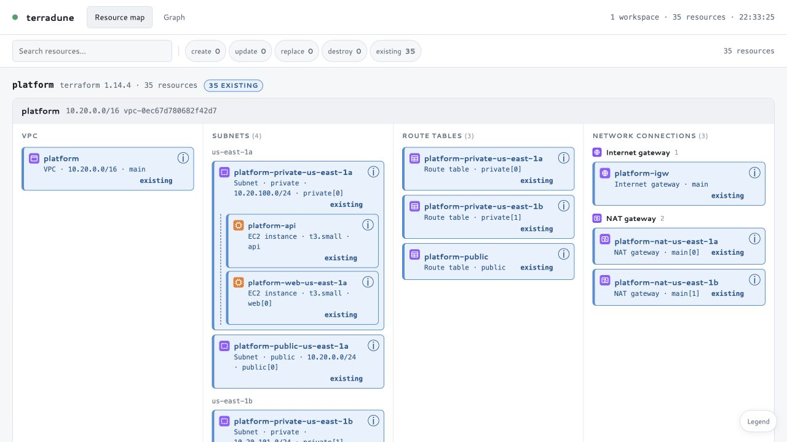
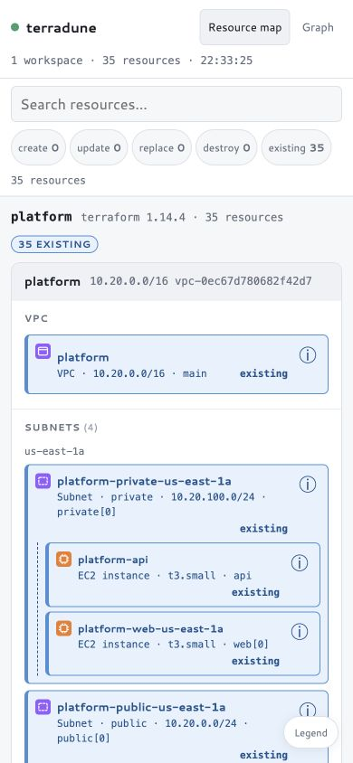

# Terradune Review, 2026-09-14

Reviewed baseline `fc556ab6fd03e66cad99b06677785277bc45603f`. The local UI ran against `examples/platform`, which ships synthetic applied state: 35 resources, all existing. Terraform planning used the default `-refresh=false`; no apply was run.

## Changes In This PR

- Resource cards provide separate native buttons for pinning a path and opening details. Both work with Enter/Space, have accessible names, and avoid nesting interactive controls inside each other. Pin state is exposed with `aria-pressed`; the existing mouse double-click action remains available.
- The details drawer uses a native modal dialog, moves focus to Close, restores focus to its opener, and ignores responses for earlier selections or closed dialogs. Loading a new resource clears the previous icon and status.
- Tabs expose selected state and support arrow keys, Home, and End. Search has a persistent accessible label; status filters expose pressed state and retain focus when rerendered. Clearing filters returns focus to search.
- Map columns reflow to two columns on tablets and one on narrow phones. Controls have larger targets, card text wraps, and detail tables fit narrow drawers. Status text no longer uses reduced opacity, and reduced-motion preferences disable transitions and the busy animation.
- Ribbon sizing discards the previous overlay dimensions before measuring content. Resizing from desktop to mobile no longer retains desktop-width horizontal scrolling.

## Validation

| Check | Result |
| --- | --- |
| `GOCACHE=$PWD/.cache/go-build go test ./...` | Pass, before and after changes |
| `GOCACHE=$PWD/.cache/go-build go vet ./...` | Pass |
| `go test -v ./internal/server` with the same cache setting | Pass; JavaScriptCore page checks executed, not skipped |
| `git diff --check` | Pass |
| Live browser at 1280x720, 768x1024, 390x844, 320x740 | Page and map widths fit each viewport, including transitions between sizes |
| Keyboard interaction | Enter pins a resource; details opens from its named button; Close receives focus; Escape returns focus without dropping the pin; a second Escape releases it |
| Search and filters | `nat` shows 6 of 35; destroy filter produces no cards; clearing restores 28 displayed cards and search focus |
| Graph view | Arrow-key tab navigation renders all 35 graph nodes |
| Browser diagnostics | No warning/error entries recorded during final verification |

The 28 displayed cards include repeated placements in subnet and load-balancer sections; routes and associations contribute to the 35-resource inventory but are represented by connections. Automated regression checks cover native keyboard-click events, selected tab state, details dispatch, out-of-order requests, closing during a request, error escaping, and focus restoration. The browser checks supplement the existing DOM stub; this is not a full screen-reader or WCAG conformance audit. Browser coverage here is Chromium through the local in-app browser, not Safari/Firefox or physical touch devices.

## Before And After

Desktop, 1280x720:

| Before | After |
| --- | --- |
|  |  |

Mobile, 390x844:

| Before | After |
| --- | --- |
|  |  |

## Prioritized Follow-Ups

These are findings from source inspection and remain outside this focused UI change.

1. **P1: Honor Terraform sensitive-value masks before serving details.** `internal/graph/detail.go`, `BuildDetails`, copies `Change.Before` and `Change.After` into responses without consulting sensitivity metadata. `internal/server/server.go`, `handleResource` and `relate`, then exposes these values for the resource and its dependencies. Sensitive attributes can consequently appear in the browser and screenshots. Recursively redact masked values at ingestion and add nested object/list fixtures; audit map metadata too. The current localhost bind limits network exposure but does not redact rendered values.
2. **P1: Qualify graph and selection identity by workspace.** `internal/server/index.html`, `wireHover`, merges all workspaces' links into one adjacency map, while `pinnedId`, path matching, and `nodeById` use only the Terraform address. Two workspaces containing `aws_vpc.main` can share highlights or resolve the wrong display name. Carry `(workspace, address)` through adjacency, selection, and ribbon data; test two workspaces with identical addresses and different topology.
3. **P2: Serialize initial plans and rebuilds through the same scheduler.** `main.go`, `run`, starts `planAll` independently of the rebuild consumer, so a file change during the initial plan can launch another plan for the same workspace. The consumer's `queued` flag is removed before it reads the next event, so it does not coalesce queued events as its comment promises. Use one per-workspace in-flight/dirty state with the existing global concurrency limit, and test edits during initial and subsequent plans.
4. **P2: Keep the latest SSE snapshot for slow clients.** `internal/server/server.go`, `broadcastLocked`, drops new events when a client's four-slot channel is full. If the final successful plan is dropped, the browser can remain on an older or rebuilding snapshot until another change occurs. Coalesce pending snapshots to the newest value and test that the last result reaches a stalled client after it resumes.
5. **P2: Make browser coverage portable and complete keyboard access in Graph.** `internal/server/page_test.go` skips the page suite when JavaScriptCore is unavailable. Add a supported cross-platform JS runner and browser smoke tests in CI, including an accessibility scanner, modal navigation, live replans, and responsive resize. Graph still needs named keyboard zoom/pan/fit controls and an accessible relationship listing; muted secondary text and dimmed-path contrast need a full audit.
6. **P3: Separate frontend responsibilities while keeping the embedded stack.** `internal/server/index.html` combines CSS, topology derivation, icon data, rendering, live state, and interaction code. Extract embedded stylesheet/script files and isolate pure topology functions first. Preserve the existing Go packages (`ingest`, `graph`, `server`, `watch`), self-contained assets, and fixture-driven tests. Add generation guards to asynchronous ELK layouts and preserve keyboard focus across live map rerenders.

## Overall Assessment

The Go package boundaries and offline embedded assets suit a small local infrastructure tool. Graph fixtures exercise a broad resource set and provide a useful foundation for changes. The main maintainability pressure is concentrated in the frontend, while scheduling and streamed-state behavior need tests at their concurrency boundaries.

The current visual vocabulary is appropriately restrained for infrastructure review: status text accompanies color, resource icons aid scanning, and workspace/VPC hierarchy is explicit. This PR improves reachability and readability within that vocabulary. The mobile tradeoff is a longer vertical map; a future compact relationship list would help users compare distant resources without relying on spatial ribbons.
