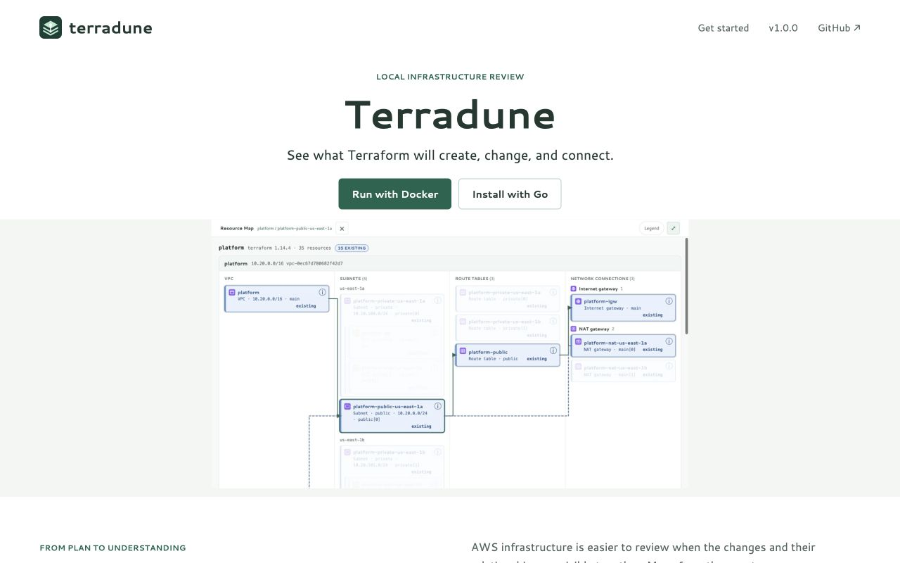
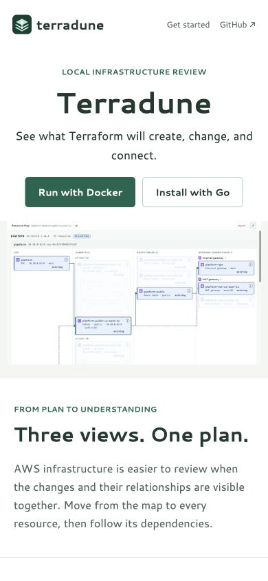
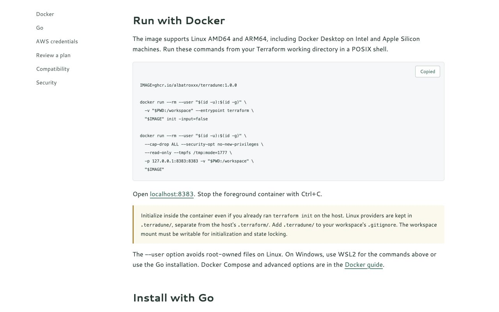
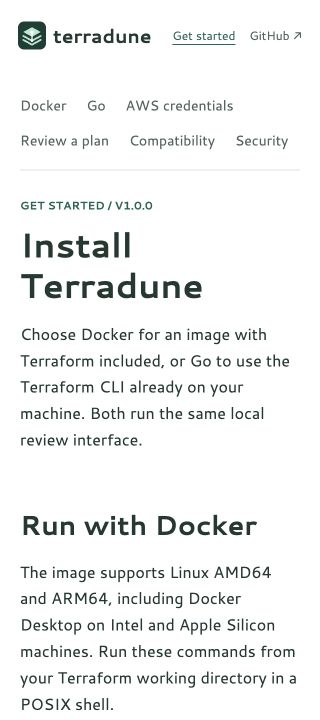

# v1 Release Readiness

PR: https://github.com/albatroxxx/terradune/pull/4

## Scope

This release packages the existing Resource Map, Plan, and Graph interface for Docker and Go installation. It also closes two earlier review findings: sensitivity-aware display metadata and serialized/coalesced planning with newest-snapshot delivery. It adds HTTP defense-in-depth, clean cancellation, one-shot failure status, a static GitHub Pages site, security policy, release automation, and launch drafts.

## Evidence

- Local `go test -race ./...`, `go vet ./...`, `git diff --check`, static-site checks, and actionlint pass.
- Linux/macOS/Windows build, vet, formatting, and race tests passed after explicitly preserving LF in Go sources on Windows.
- Both AMD64 and ARM64 images passed real container init, plan, resource/dependency API, liveness, rebinding rejection, non-root default, provider-directory isolation, and clean SIGTERM shutdown tests. No cloud credentials or apply were used.
- The initial upstream image failed the vulnerability gate. Rebuilding unmodified Terraform v1.16.2 with Go 1.27.1 and applying Alpine security updates made the gate pass. No vulnerability exceptions were added.
- Native preview used the existing synthetic platform workspace with refresh disabled. The public site uses synthetic screenshots only.
- Site navigation, Docker anchor, and copy command feedback were verified in Chromium. Home and docs have no page overflow at 320px and 390px; desktop metadata/assets load correctly. The site checker validates four HTML pages, local links/anchors, canonical/social metadata, image alternatives, JSON-LD version, and sitemap coverage.

Final CI and publication results are recorded in the PR and release workflow. Docker was not installed on the development machine, so actual Docker execution was performed on GitHub-hosted runners, not represented as a local test.

## Screenshots

The [earlier review report](README.md#before-and-after) retains the original UI before/after evidence. There was no previous public website; these are first-site captures, not a fabricated before comparison.

## Next Priorities

1. **P2: Lifecycle correctness.** Explicit data-source/read, import/move/forget, output, deferred-plan, and alias-aware account/region models with provider-independent fixtures.
2. **P2: Browser/accessibility automation.** Real-browser CI, automated accessibility checks, screen-reader review, focus preservation through live updates, and Firefox/Safari coverage.
3. **P2: Runtime stress coverage.** Filesystem-event bursts, long-running providers, cancellation failures, backend/CLI-workspace combinations, and Windows credential-path behavior.
4. **P3: Large estates.** Measured 1k/10k-resource budgets, progressive graph exploration, and topology extraction before virtualization or extra map special cases.
5. **P3: Discovery.** Owner Search Console verification/sitemap submission, a short real workflow demo, and selective community launch using the prepared drafts. SEO metadata alone is not a ranking guarantee.
